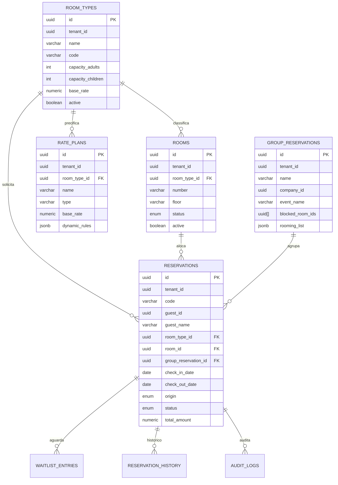

# Diagrama Relacional - Modulo de Reservas

```mermaid
erDiagram
  ROOM_TYPES ||--o{ ROOMS : classifica
  ROOM_TYPES ||--o{ RATE_PLANS : precifica
  ROOM_TYPES ||--o{ RESERVATIONS : solicita
  ROOMS ||--o{ RESERVATIONS : aloca
  GROUP_RESERVATIONS ||--o{ RESERVATIONS : agrupa
  RESERVATIONS ||--o{ WAITLIST_ENTRIES : aguarda
  RESERVATIONS ||--o{ RESERVATION_HISTORY : historico
  RESERVATIONS ||--o{ AUDIT_LOGS : audita

  ROOM_TYPES {
    uuid id PK
    uuid tenant_id
    varchar name
    varchar code
    int capacity_adults
    int capacity_children
    numeric base_rate
    boolean active
  }

  ROOMS {
    uuid id PK
    uuid tenant_id
    uuid room_type_id FK
    varchar number
    varchar floor
    enum status
    boolean active
  }

  RATE_PLANS {
    uuid id PK
    uuid tenant_id
    uuid room_type_id FK
    varchar name
    varchar type
    numeric base_rate
    jsonb dynamic_rules
  }

  RESERVATIONS {
    uuid id PK
    uuid tenant_id
    varchar code
    uuid guest_id
    varchar guest_name
    uuid room_type_id FK
    uuid room_id FK
    uuid group_reservation_id FK
    date check_in_date
    date check_out_date
    enum origin
    enum status
    numeric total_amount
  }

  GROUP_RESERVATIONS {
    uuid id PK
    uuid tenant_id
    varchar name
    uuid company_id
    varchar event_name
    uuid[] blocked_room_ids
    jsonb rooming_list
  }
```
