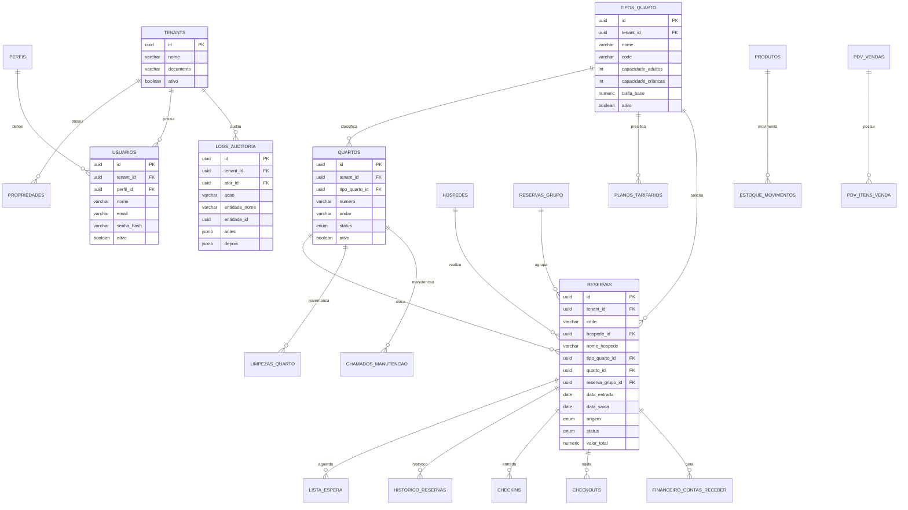

# Diagrama Relacional - Banco em Portugues

```mermaid
erDiagram
  TENANTS ||--o{ PROPRIEDADES : possui
  TENANTS ||--o{ USUARIOS : possui
  PERFIS ||--o{ USUARIOS : define
  TIPOS_QUARTO ||--o{ QUARTOS : classifica
  TIPOS_QUARTO ||--o{ PLANOS_TARIFARIOS : precifica
  TIPOS_QUARTO ||--o{ RESERVAS : solicita
  HOSPEDES ||--o{ RESERVAS : realiza
  QUARTOS ||--o{ RESERVAS : aloca
  RESERVAS_GRUPO ||--o{ RESERVAS : agrupa
  RESERVAS ||--o{ LISTA_ESPERA : aguarda
  RESERVAS ||--o{ HISTORICO_RESERVAS : historico
  RESERVAS ||--o{ CHECKINS : entrada
  RESERVAS ||--o{ CHECKOUTS : saida
  QUARTOS ||--o{ LIMPEZAS_QUARTO : governanca
  QUARTOS ||--o{ CHAMADOS_MANUTENCAO : manutencao
  PRODUTOS ||--o{ ESTOQUE_MOVIMENTOS : movimenta
  PDV_VENDAS ||--o{ PDV_ITENS_VENDA : possui
  RESERVAS ||--o{ FINANCEIRO_CONTAS_RECEBER : gera
  TENANTS ||--o{ LOGS_AUDITORIA : audita

  TENANTS {
    uuid id PK
    varchar nome
    varchar documento
    boolean ativo
  }

  USUARIOS {
    uuid id PK
    uuid tenant_id FK
    uuid perfil_id FK
    varchar nome
    varchar email
    varchar senha_hash
    boolean ativo
  }

  TIPOS_QUARTO {
    uuid id PK
    uuid tenant_id FK
    varchar nome
    varchar code
    int capacidade_adultos
    int capacidade_criancas
    numeric tarifa_base
    boolean ativo
  }

  QUARTOS {
    uuid id PK
    uuid tenant_id FK
    uuid tipo_quarto_id FK
    varchar numero
    varchar andar
    enum status
    boolean ativo
  }

  RESERVAS {
    uuid id PK
    uuid tenant_id FK
    varchar code
    uuid hospede_id FK
    varchar nome_hospede
    uuid tipo_quarto_id FK
    uuid quarto_id FK
    uuid reserva_grupo_id FK
    date data_entrada
    date data_saida
    enum origem
    enum status
    numeric valor_total
  }

  LOGS_AUDITORIA {
    uuid id PK
    uuid tenant_id FK
    uuid ator_id FK
    varchar acao
    varchar entidade_nome
    uuid entidade_id
    jsonb antes
    jsonb depois
  }
```
